# GUET-UTMS 雷达显控平台

UTMS 是面向 Windows 的 Qt Widgets 雷达显控应用。第一阶段接收 UDP JSON 当前帧快照，并同步显示雷达位置、目标地图标记、航迹表格、类别统计和运行状态；第二阶段增加启动登录、单路 RTSP 实时预览、按需 YOLO26 检测、RTSP 原始视频录像和按需系统监控；第三阶段增加实时短航迹、SQLite 历史记录与回放、电子围栏和目标告警。产品行为以 [`docs/PRD.md`](docs/PRD.md)、[`docs/PRD-phase2.md`](docs/PRD-phase2.md) 和 [`docs/PRD-phase3.md`](docs/PRD-phase3.md) 为准。

## 开发环境

正式验收环境：

- Windows 10/11 64 位；
- Qt 6.8 LTS，MSVC 2022 64 位套件；
- CMake 3.16 或更高版本；
- 支持 C++17 的 MSVC 2022；
- Python 3.9 或更高版本（仅模拟器需要）。

需要安装以下 Qt 模块：

- Core、Gui、Widgets；
- Network、Concurrent、Sql；
- Charts；
- WebEngineWidgets、WebChannel；
- Test（启用自动化测试时需要）。

RTSP 预览需要将 Windows x64 FFmpeg shared 开发包放在 `third_party/ffmpeg/`，其中至少包含 `include/`、`lib/` 和 `bin/`。YOLO26 检测需要 Windows x64 CPU 版 ONNX Runtime，目录为 `third_party/onnxruntime/`，并包含完整 `include/`、`lib/onnxruntime.lib` 和 `lib/onnxruntime.dll`。CMake 仅在 `media` 模块链接这些依赖，并将运行时 DLL 与 `models/yolo26/` 复制到应用旁。

## 构建与测试

在 “x64 Native Tools Command Prompt for VS 2022” 或已加载 MSVC 2022 环境的 PowerShell 中执行。将 `C:\Qt\6.8.3\msvc2022_64` 替换为本机 Qt 路径：

```powershell
cmake -S . -B build -G Ninja `
    -DCMAKE_BUILD_TYPE=Debug `
    -DCMAKE_PREFIX_PATH=C:\Qt\6.8.3\msvc2022_64 `
    -DPROJECT_BUILD_TESTS=ON
cmake --build build
ctest --test-dir build --output-on-failure
```

若使用 Visual Studio 多配置生成器，构建和测试命令应带配置名：

```powershell
cmake --build build --config Debug
ctest --test-dir build -C Debug --output-on-failure
```

`PROJECT_BUILD_TESTS` 默认关闭；只有配置为 `ON` 时才会生成 Qt Test 目标。测试覆盖雷达核心规则、表格排序筛选、登录凭据验证、系统监控启停与采样隔离、RTSP 状态转换、录像状态与文件命名、YOLO 模型配置与最新帧策略，以及实时航迹、历史采样与 SQLite 故障恢复、历史查询和回放、围栏几何、告警状态机、持久化与告警中心交互。

Release 配置还会生成并随绿色目录安装 `UTMS_video_performance_acceptance.exe`。该工具固定使用 640×640 YOLO26n 和 CPU Execution Provider，预热后测量预处理、推理与后处理吞吐；默认阈值为 10 FPS：

```powershell
.\dist\UTMS\bin\UTMS_video_performance_acceptance.exe --warmup 5 --iterations 100
```

性能数值依赖参考 PC，工具因此不加入日常 CTest；最终结果应记录到人工验收清单。

开发构建还会在构建目录的 `acceptance/` 下生成 `UTMS_rtsp_recording_acceptance.exe`。配合真实 RTSP 或本地 MediaMTX 测试源运行时，该工具会录制约 4 秒视频，并重新打开 MP4 验证 H.264/H.265 视频轨和可读数据包；成功输出包含 `RECORDING_VERIFIED=1`。该工具用于开发验收，不随绿色发布目录安装。测试源搭建见 [`docs/media_test.md`](docs/media_test.md)。

## 启动登录

应用初始化日志后首先显示“GUET-UTMS 用户登录”对话框，只有登录成功后才创建主窗口并初始化 UDP、视频等工作线程。固定演示凭据为账号 `root`、密码 `123456`；密码默认留空并掩码显示，可点击“登录”或按 Enter 提交。空凭据或错误凭据会显示提示、清空密码并重新聚焦密码框；取消或关闭登录对话框会直接退出应用。

该门禁仅用于当前演示版本，不包含注册、找回密码、记住密码、角色权限、退出登录或凭据持久化。

## 从构建目录运行

启动 `UTMS.exe`，在“系统配置”页保留默认端口 `10000` 并点击“启动监听”。UDP 状态含义：

- 红色：监听未启动或绑定失败；
- 黄色：已监听，但尚无最近 3 秒内被接受的合法数据；
- 绿色：最近 3 秒内收到过被接受的合法数据。

程序不会自动启动 UDP 监听，也不会持久化端口、地图或窗口配置。

## RTSP 实时预览

应用启动后不会自动访问摄像头。在“视频流”Tab 中可编辑默认地址 `rtsp://192.168.1.101:8554/camera_1`，点击“连接”后使用 TCP RTSP 拉流；点击“断开”会停止网络访问并立即清除画面。地址只在当前运行中使用，不写入配置文件。

连接成功后检测默认关闭。点击“开启检测”时才加载 `models/yolo26/yolo26n.onnx`；视频画面叠加中文类别、置信度和检测框。关闭检测会继续预览并清除检测框，模型保留到手动断开或退出；短暂断流重连后恢复原检测开关。模型加载或推理失败只关闭检测并显示错误，不中断 RTSP 预览。

界面区分连接中、播放中、重连中和已断开状态。连接失败或播放中断时会立即清除旧画面，并在没有人工断开的前提下每 3 秒重试。正常视频帧不会逐帧写日志；连接、断开、重连和解码错误会写入运行日志。

## RTSP 原始视频录像

仅在 RTSP 处于“播放中”时可点击“开始录制”。录像复用当前唯一 RTSP 会话已经读取的 H.264/H.265 原始视频包，从请求后的下一个关键帧开始写入 MP4，不建立第二条连接、不使用画面截图、不重新编码，也不包含音频、YOLO 检测框或 UTMS 界面。若 10 秒内没有可写关键帧，界面会显示失败且不保留空文件。

录像文件保存在可执行文件旁的 `recordings/` 目录，目录按需创建，文件名为 `UTMS_yyyyMMdd_HHmmss.mp4`；同名时追加 `_01`、`_02` 等后缀，绝不覆盖已有文件。视频控件可停止录像或直接打开该目录。主动断开、流中断、自动重连、关闭窗口和退出应用都会尽可能安全封尾当前文件；重连成功后不会自动恢复录像。

## 系统监控

“系统监控”Tab 默认关闭。点击“开启监控”后，每秒显示主机 CPU、主机物理内存、UTMS 进程 CPU 和 UTMS 进程内存；点击“停止监控”会停止采样并立即清空旧数值。单项指标读取失败只影响该指标，不会中断 UDP、地图、RTSP、录像或 YOLO 功能。监控开关和历史数值均不持久化。

## 在线高德地图

复制配置示例并填写高德 Web JavaScript API Key 与安全密钥：

```powershell
Copy-Item config\amap.example.json config\amap.json
```

```json
{
    "key": "你的高德 Web 端 Key",
    "securityCode": "你的安全密钥"
}
```

真实 `config/amap.json` 已被 Git 忽略，不得提交。Key 可在[高德开放平台控制台](https://console.amap.com/dev/key/app)创建和管理。

应用从可执行文件旁的 `config/amap.json` 读取配置。配置缺失、JSON 无效或字段为空时，在线地图显示明确错误且不会自动切换离线地图。默认中心为经度 `110.416819`、纬度 `25.311724`，默认缩放级别为 `17`，允许范围为 `15` 至 `19`。

## 离线地图瓦片

将 GCJ-02 高德街道瓦片放到可执行文件旁的固定相对路径：

```text
data/map/amap/{z}/{x}/{y}.png
```

离线模式支持缩放级别 `15` 至 `19`，只支持街道图。瓦片缺失时显示灰色占位内容，地图仍可平移和缩放且不会连续弹窗。实际瓦片不提交到仓库；绿色发布目录的 `bin/data/map/amap/README.md` 也包含放置说明。

## UDP 模拟器

模拟器默认向 `127.0.0.1:10000` 以约 `11 FPS` 发送每帧 `10` 至 `20` 个目标。每个报文都是完整 `tracks` 快照，序号逐帧递增，包含合法雷达位置；默认目标池确定性覆盖汽车、卡车、行人、自行车和未知五类。

```powershell
python scripts\udp_simulator.py
```

可修改目标 IP、端口、目标数量或范围以及发送频率：

```powershell
python scripts\udp_simulator.py `
    --host 127.0.0.1 `
    --port 10000 `
    --targets 12-18 `
    --fps 11
```

`--targets` 接受单个数量（例如 `15`）或闭区间（例如 `10-20`）。按 `Ctrl+C` 停止模拟器。

## 实时短航迹

系统配置页可将实时航迹显示时长切换为关闭、10 秒、30 秒或 1 分钟，默认显示选中目标最近 30 秒的轨迹；勾选“显示所有目标航迹”后显示当前目标的全部短航迹。轨迹按目标类别着色并逐段渐隐，目标短时消失后可在 5 秒内续接；采样间隔超过 3 秒、位置跳变超过 200 米或消失超过 5 秒时会自动断段。

在线与离线地图共用中心、缩放、选中目标、实时航迹、围栏和告警位置状态，切换地图模式不会清空这些内容。

## 历史记录与回放

UDP 监听成功时会创建历史会话，停止监听时关闭会话。历史数据保存在可执行文件旁的 `data/utms.sqlite`，默认以 2 FPS 记录已接受的合法帧，可在系统配置页切换为 1 FPS、5 FPS 或全帧；保留期限默认 7 天，可设置为 1 至 30 天。采样频率、保留期限、围栏和告警规则会持久化，RTSP 地址、检测开关、系统监控开关、UDP 端口和地图状态仍不持久化。

“历史回放”Tab 可按时间、会话、航迹 ID 和类别查询并导出 CSV。查询完成后可进入回放，使用播放、暂停、上一帧、下一帧、时间轴和 0.5×、1×、2×、4×速度控制；超过 5 秒的数据缺口会直接跳过并提示，不会插值。回放期间实时 UDP 接收、历史记录和告警分析继续运行，但不会覆盖回放画面；返回实时模式后立即恢复最新实时帧。

SQLite 打开或写入失败时，历史状态会显示错误并每 5 秒尝试恢复。故障只影响历史持久化，不会阻塞实时地图、表格、统计或告警分析。

## 电子围栏与目标告警

“电子围栏”Tab 支持创建、编辑、定位、启停、显示和删除圆形、非旋转矩形及 3 至 20 个顶点的非自交多边形围栏。禁用围栏不会参与新的告警判断，也不会删除已有告警历史。

“告警规则”Tab 支持稳定进入、稳定离开、围栏内停留超时和围栏内超速四类规则；超速阈值单位为 m/s。规则可配置目标类别、等级、阈值、确认时间、冷却时间和启用状态。系统使用确认时间、5 米离开迟滞、3 秒目标短时消失保持以及条件恢复后的冷却去重，避免边界抖动和持续条件产生重复告警。

“告警中心”Tab 可查询、导出 CSV、单条或批量确认告警并填写处理备注。严重告警使用一次提示音、短暂地图高亮和非模态通知；点击告警可定位到发生位置。历史回放只显示已经持久化的告警，不会重新执行规则或生成新告警。

## 运行结果

以下截图来自 Windows 实机人工验收，覆盖 #26 的主界面、跨模块联动和第三阶段功能。完整验收项见 [`docs/acceptance-checklist.md`](docs/acceptance-checklist.md)。

### 登录与实时雷达

| 登录界面 | 在线地图主界面 |
| --- | --- |
| 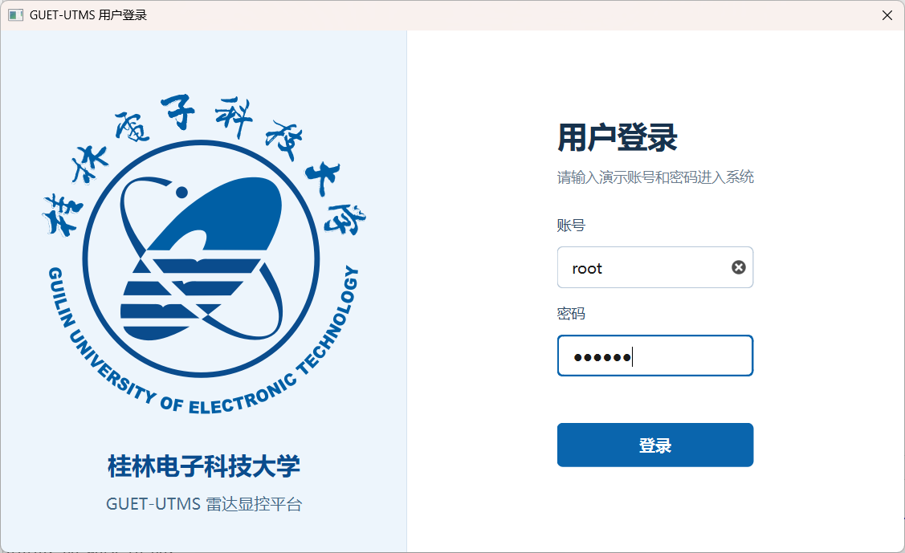 | 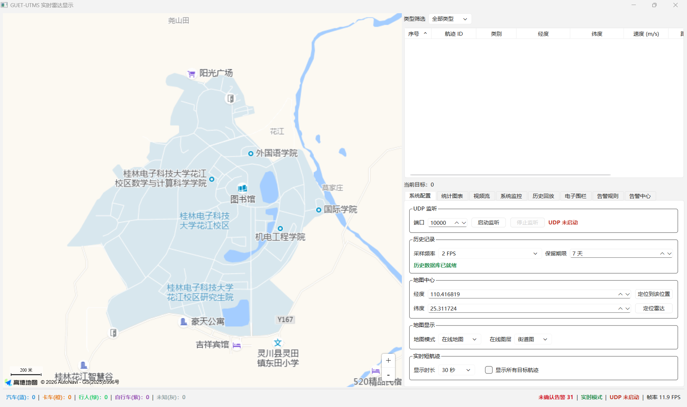 |

| UDP 实时目标与统计 | 实时短航迹与离线地图 |
| --- | --- |
| 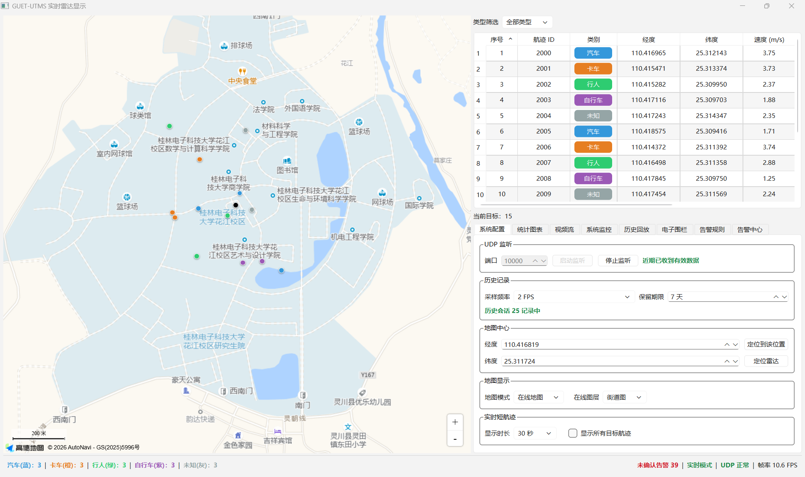 | 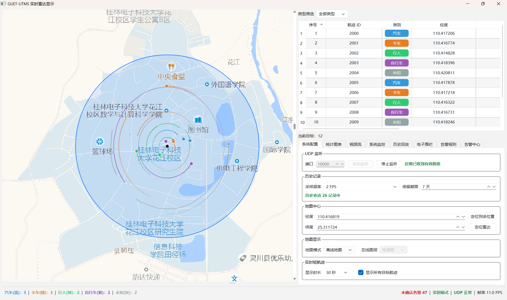 |

### 配置、统计、视频与监控

| 系统配置 | 统计图表 |
| --- | --- |
| 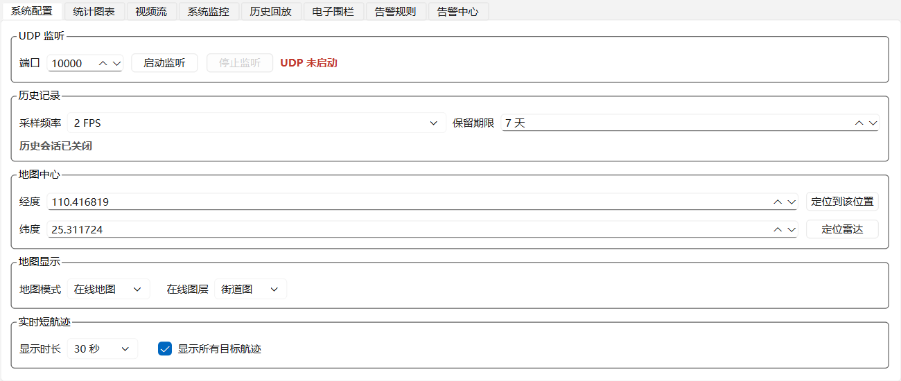 | 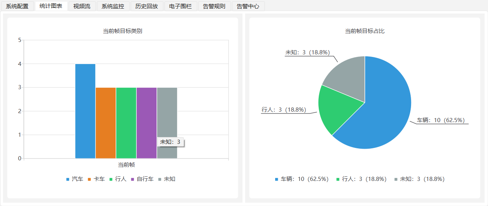 |

| 视频流 | 系统监控 |
| --- | --- |
| 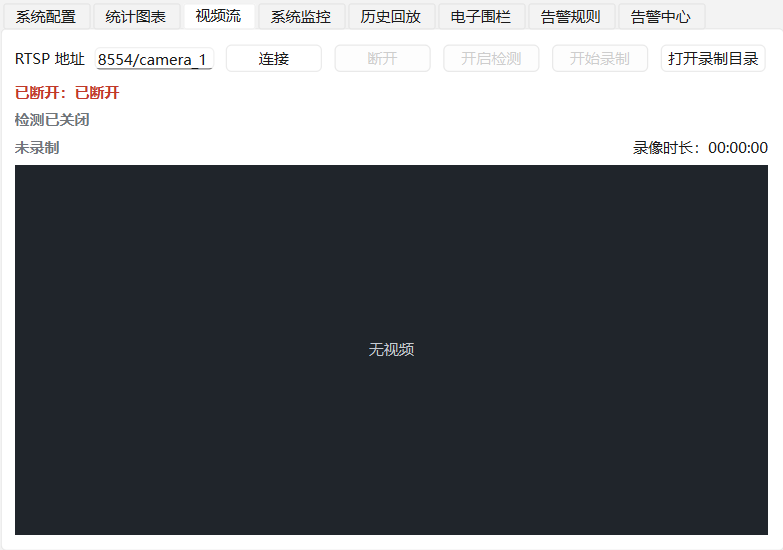 | 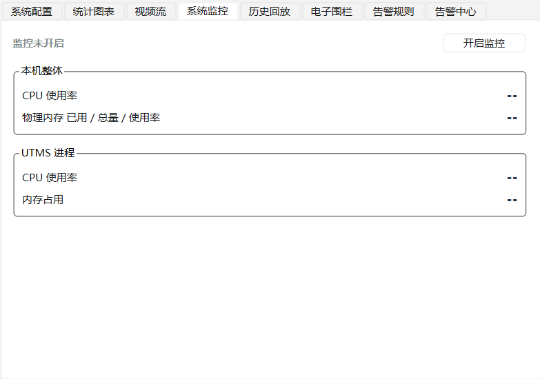 |

### 历史、围栏与告警

| 历史查询与回放 | 电子围栏管理 |
| --- | --- |
| 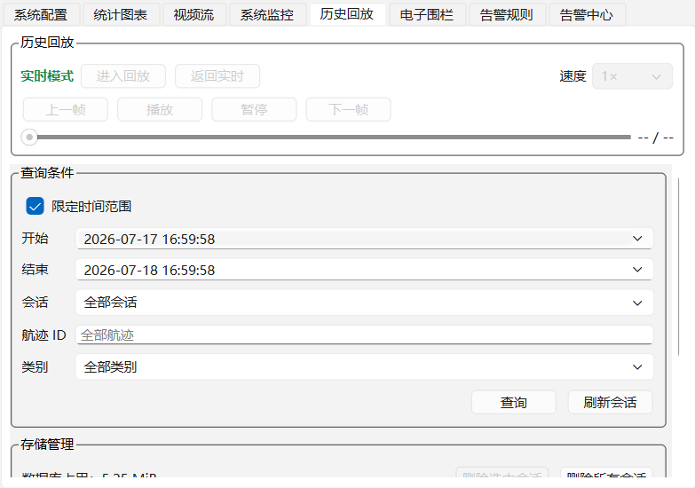 | 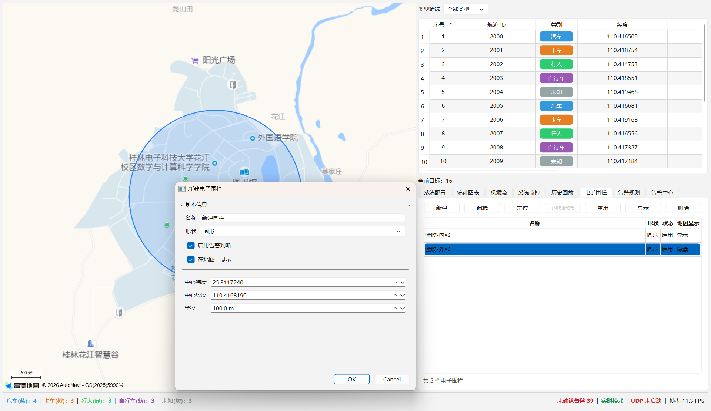 |

| 告警规则 | 告警中心 |
| --- | --- |
| 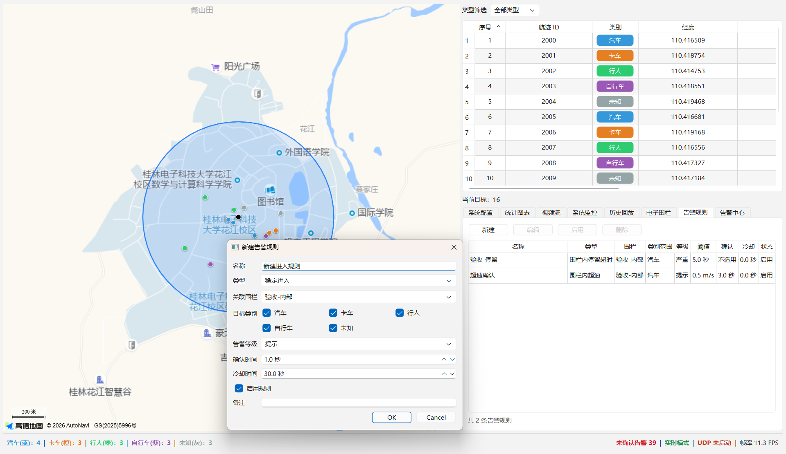 | 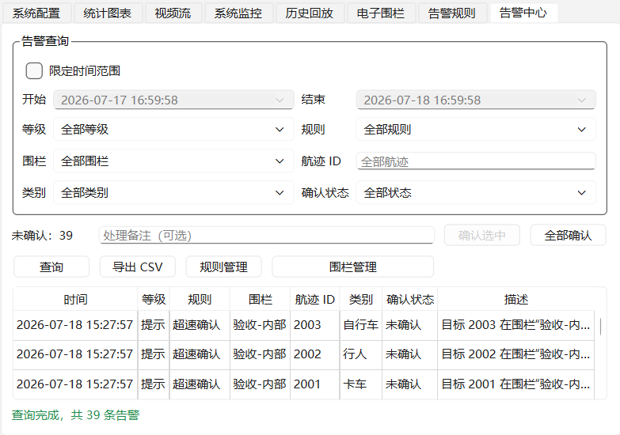 |

## 运行日志

日志位于可执行文件旁的 `logs/utms.log`。应用记录程序生命周期、登录取消、UDP 绑定、报文校验、序号拒绝或跳跃、序号基准重置、地图配置、瓦片缺失以及 RTSP 连接、断开、重连和解码错误等事件。检测日志区分模型资源加载失败、ONNX 推理初始化失败和运行中推理失败；录像日志记录请求、开始写入、停止原因、输出路径、保存或清理失败；系统监控日志记录启停和指标读取失败；历史与告警日志记录会话生命周期、数据库故障恢复、清理、围栏和规则变更、告警生成与确认。严重错误使用 `CRITICAL` 或 `FATAL`。应用不记录密码，也不会为正常视频帧、正常录像包、正常检测结果、历史采样点、规则评估或每秒正常监控样本写高频日志。

单个文件最大 10 MB，最多保留当前文件及轮转文件共 5 个。提交故障信息时请保留全部 `utms*.log`。

## Windows 绿色发布

使用 Release 配置生成独立安装前缀。Qt 6 的 CMake 部署 API 会在安装时收集所需的 Qt DLL、插件和 WebEngine 资源，CMake 同时把 MSVC 运行库 DLL 安装到可执行程序旁：

```powershell
cmake -S . -B build-release -G Ninja `
    -DCMAKE_BUILD_TYPE=Release `
    -DCMAKE_PREFIX_PATH=C:\Qt\6.8.3\msvc2022_64 `
    -DCMAKE_INSTALL_PREFIX=$PWD\dist\UTMS `
    -DPROJECT_BUILD_TESTS=ON
cmake --build build-release
ctest --test-dir build-release --output-on-failure
cmake --install build-release
```

安装最后会自动检查 FFmpeg、ONNX Runtime 和 `models/yolo26/` 的关键文件；缺少任一运行资源时安装失败，不应交付该目录。

安装后的关键结构：

```text
dist/UTMS/
├── README.md
├── acceptance-checklist.md
├── licenses/ffmpeg/、licenses/onnxruntime/
├── plugins/、resources/、translations/（Qt 运行资源）
└── bin/
    ├── UTMS.exe
    ├── UTMS_video_performance_acceptance.exe
    ├── Qt6*.dll、QtWebEngineProcess.exe、msvcp*.dll 和 vcruntime*.dll
    ├── avcodec-*.dll、avformat-*.dll、avutil-*.dll、swscale-*.dll 等 FFmpeg 运行库
    ├── onnxruntime.dll
    ├── models/yolo26/yolo26n.onnx、classes.txt、model.json
    ├── config/
    │   └── amap.example.json
    ├── data/
    │   ├── utms.sqlite（首次运行时创建）
    │   └── map/amap/
    │       └── README.md（以及本机已有的 *.png 瓦片）
    └── logs/
        └── README.md
```

发布前在绿色目录中按需将 `bin/config/amap.example.json` 复制为 `bin/config/amap.json` 并填写部署环境自己的 Key。不要把真实 Key 放入公开压缩包。随后在未配置 Qt 开发环境的 Windows 10/11 64 位机器上启动 `bin/UTMS.exe` 进行最终验收。

启动登录、真实 RTSP、检测开关、录像与断流封尾、系统监控、500 ms 端到端延迟和两小时稳定性无法全部由普通单元测试替代。完整步骤与记录表见 [`docs/acceptance-checklist.md`](docs/acceptance-checklist.md)。

## 常见问题

### CMake 找不到 Qt

确认 `CMAKE_PREFIX_PATH` 指向与编译器匹配的 Qt 目录，例如 `C:\Qt\6.8.3\msvc2022_64`，并确认已安装 Charts、WebEngine 和 WebChannel。

### 程序提示缺少 DLL 或平台插件

不要直接复制单个构建产物作为发布包。重新执行 `cmake --install build-release`，并从完整的安装前缀运行。确认构建 Qt 与目标机器架构均为 64 位。

### 在线地图空白或提示配置错误

检查 `bin/config/amap.json` 是否存在、是否为合法 JSON，以及 `key` 和 `securityCode` 是否非空。再检查 WebEngine 网络访问、防火墙和高德控制台中的 Key 类型与安全配置。

### 离线地图显示“暂无离线地图”

检查目录是否严格为 `bin/data/map/amap/{z}/{x}/{y}.png`，缩放级别是否在 `15` 至 `19`，瓦片是否为高德 GCJ-02 街道瓦片。

### UDP 一直为黄色或绑定失败

先确认已经点击“启动监听”，模拟器 IP/端口与界面一致，且 Windows 防火墙允许 UDP。绑定失败时检查端口是否被其他程序占用；详细原因见 `bin/logs/utms.log`。

### RTSP 持续显示“重连中”

确认摄像头地址可从当前机器访问、服务端支持 TCP RTSP、凭据正确，并检查防火墙。再确认 FFmpeg DLL 与 `UTMS.exe` 位于同一目录；详细连接或解码错误见 `bin/logs/utms.log`。

### 数据到达但部分目标不显示

目标必须包含可转换的 `track_id`、`position.latitude` 和 `position.longitude`，坐标必须在合法范围内且不能为 `(0, 0)`。单个非法目标会被跳过，原因写入运行日志。

### 历史记录显示失败或无法查询

检查可执行文件旁的 `data/` 目录是否可写，以及 `data/utms.sqlite`、`data/utms.sqlite-wal` 和 `data/utms.sqlite-shm` 是否被其他程序占用。历史模块会每 5 秒尝试恢复；恢复后只记录后续新帧，不补写故障期间的数据。数据库故障不会停止 UDP 实时显示或告警分析，具体原因见 `logs/utms.log`。

## 范围边界

实时地图、表格和统计仍遵循单雷达当前帧完整替换语义：目标从当前帧消失后立即移除，不做多雷达融合、坐标转换、插值或位置预测。第三阶段的实时短航迹是有界显示状态，历史数据是独立的 SQLite 采样链路，二者都不会改变实时当前帧集合。

当前交付能力包含启动登录、单路 TCP RTSP 实时预览、断流恢复、按需 YOLO26 检测、原始视频录像、按需系统监控、实时短航迹、雷达历史查询与回放、电子围栏和目标告警。雷达—视频关联、多摄像头、本地视频输入、录音、检测叠加录像、录像回放/列表/导出、定时录像、告警录像、云端同步和多雷达融合仍不在范围内。
